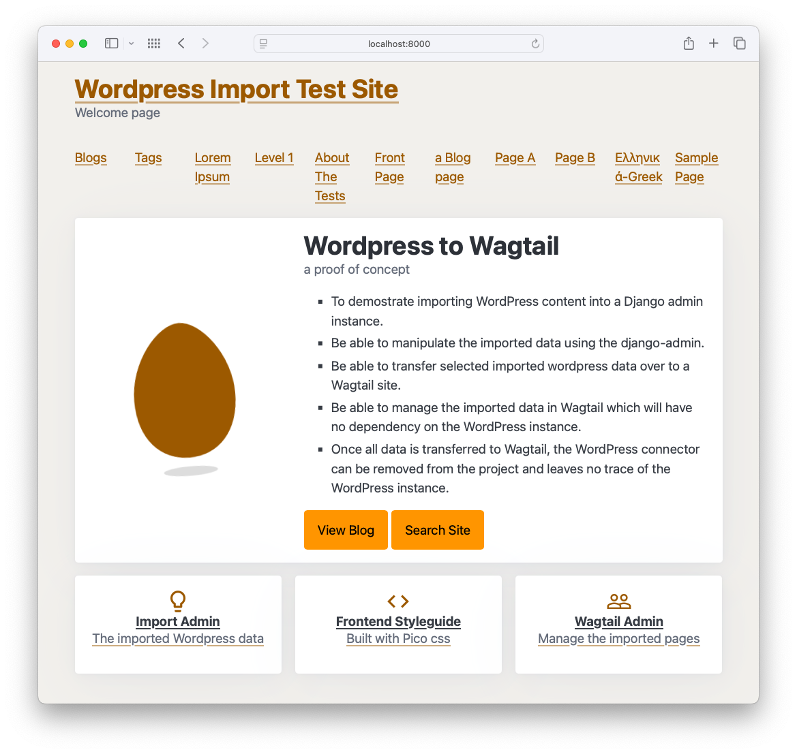
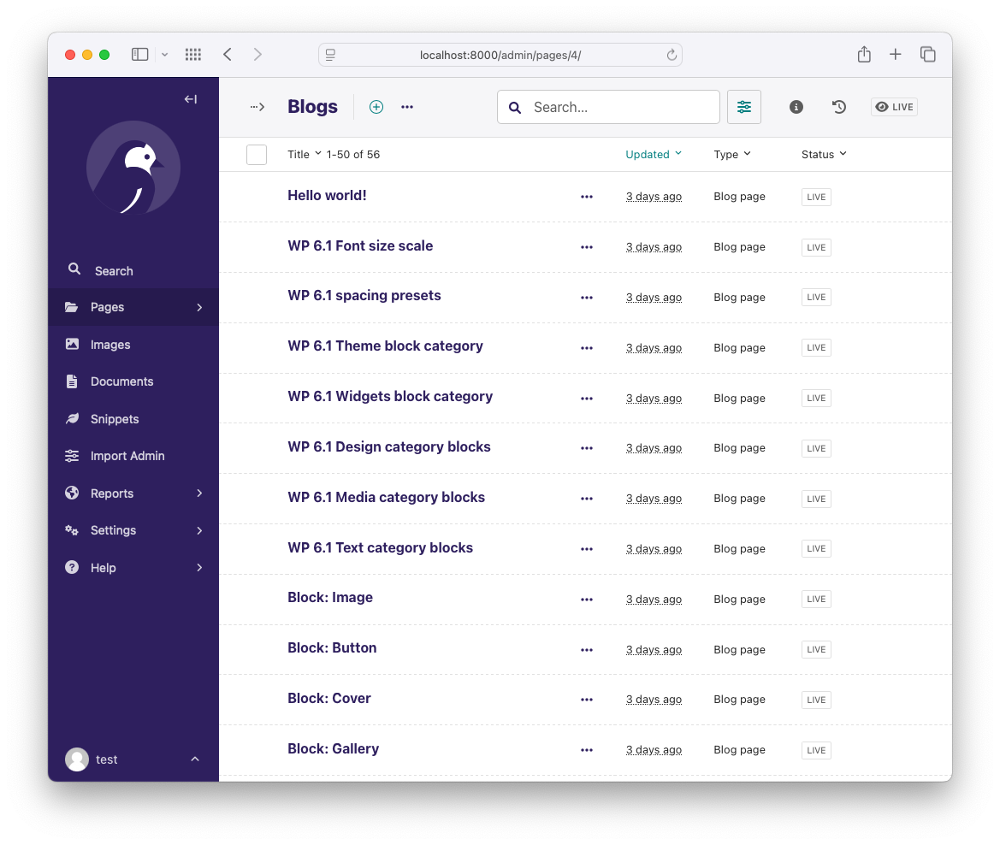
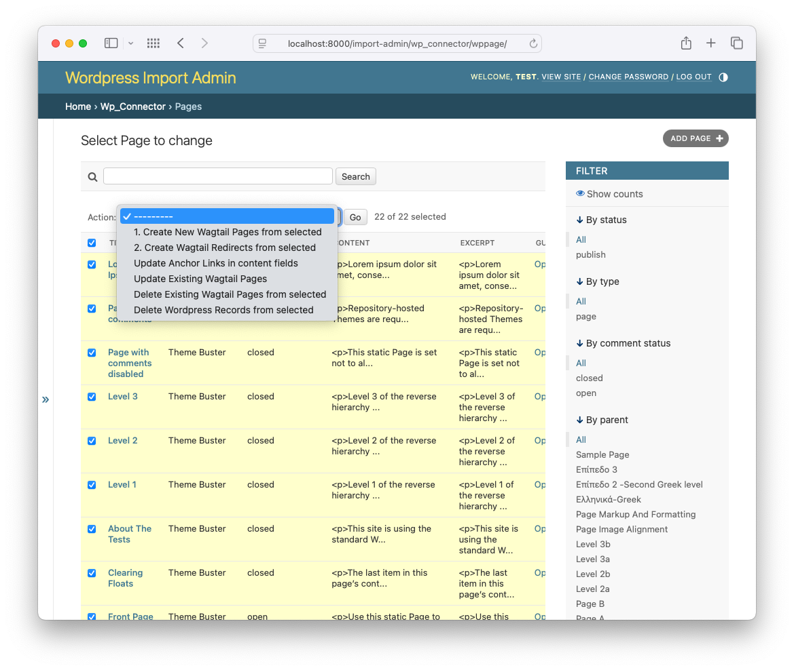

# Experimental Wordess to Wagtail Importer

This is an experimental project to import WordPress content including pages and posts into Wagtail.

## Work in progress

It's not yet ready for production use but a lot of the basic functionality is in place.

## Requirements

- Python 3.10+ (earlier versions may work)
- Poetry & Docker
- WordPress CLI
- Wordpress Data (currently using a test data set used for building themes)
- Wagtail v6.3 (earlier versions may work)
- Django v5.1 (earlier versions may work)
- Lots of patience :)

## Overall Goals

- To demostrate importing WordPress content into a Django admin instance.
- Be able to manipulate the imported data using the django-admin.
- Be able to transfer selected imported wordpress data over to a Wagtail site.
- Be able to manage the imported data in Wagtail which will have no dependency on the WordPress instance.
- Once all data is transferred to Wagtail, the WordPress connector can be removed from the project and leaves no trace of the WordPress instance.





### Importing WordPress data

The importer will use a Django management command that will import the data from a WordPress instance.

Although this example imports data from a local WordPress instance, the importer can be used to import data from any WordPress instance that has the JSON api enabled.

The only package that should be added to your final production site, for importing and transferring the Wordpress Pages and Posts to Wagtail, is the `wp_connector` package. You'll need to add some temporary configuration to Wagtail and then run the importer against your own live WordPress instance, which will need it's JSON api enabled.

### Transfering data to Wagtail

Using the django admin admin interface you will be able to select and transfer  the data to Wagtail. Posts and Pages are the main focus for the transfer but linked data such as authors, categories, tags, etc. are also be transferred across. Authors, Categories and Tags are created as snippets. Tags are created within the available Wagtail taggit integration.

The transfer process also includes creating redirects from the old WordPress urls to the new Wagtail urls.

Images and docs linked to and embedded in the transferred pages and posts are also transferred to Wagtail into the Wagtail media library. This action also including updating the links in the content to point to the new Wagtail media urls. (This is not yet implemented)

### Completing the transfer

Once you have transferred all the data to Wagtail, you can remove the WordPress connector module. This will leave you with a Wagtail site that has no dependency on the WordPress instance. You can then manage the site as you would any other Wagtail site.



## Set Up Locally

You can run this exmpampl as a test bed for your own WordPress to Wagtail migration. But this example has a Wordpress instance with test data and a Wagtail instance with the WordPress connector installed so you can see how the importer works.

### Wordpress CLI and test data

The WordPress CLI is used to setup and initialse the WordPress instance.

#### Create a virtual environment and install the requirements then activate the virtual environment:

```
poetry install
poetry shell
```

#### Start up the wordress instance and load the test data:

Docker is used to run an example WordPress instance with a theme and test data installed. This test data is available for [Wordpress Theme Design](https://raw.githubusercontent.com/WPTT/theme-unit-test/master/themeunittestdata.wordpress.xml) and has a lot of content and layouts that may not be appropriate for all use cases for transferring data accross to Wagtail but it's a good test bed to get started.

The example has it's JSON api enabled so the importer can access the data.

##### Build and initialises the wordpress instance

```
wp build
```

##### Start the wordpress docker container

```
wp up
```

##### Load the test data

```
wp load
```

You can access the WordPress site at `http://localhost:8888` with test data loaded.

You can login to the Wordpress admin is at `http://localhost:8888/wp-admin` with the username `admin` and password `password`.

### Wagtail and Django

Wagtail and Djanog are not run in Docker but are run in a virtual environment using Poetry.

#### Initilase and start Wagtail and Django:

```
wt migrate
wt superuser
wt run
```

You can access the Wagtail site at `http://localhost:8000` with the Wagtail admin at `http://localhost:8000/admin`

The username and passowrd you added above can be used to log into the Wagtail admin.

At this point there is no data in the Wagtail instance. You should see the Wagtail welcome page.

**Important** Go to the Wagtail admin and create a page, under the Home Page, called `Blog` and publish it. This is the parent page for all blog pages and is required by the transfer process. *You can name the page anything you like.*

#### Importing the data from Wordpress into Django

The importer is a sequence of django management commands. To run the importer and import all the data from the wordpress instance, run:

```
dj all
```

This will import the whole sample data set into the Django instance.

The dataset includes:

- Authors
- Categories
- Comments
- Media
- Posts
- Pages
- Tags

You can browse the django admin site to inspect the imported content.

The setup is now complete and ready for the wordpress content to be transfered to Wagtail. This is done using django-admin actions.

The django admin for transferring data is at `http://localhost:8000/import-admin`

## Transferring data to Wagtail

Transferring data to Wagtail is done using the Django admin.

1. Go to the Django admin at `http://localhost:8000/import-admin`
2. At this time only Posts and Pages are intentionally supported but any linked data such as authors, categories, tags ect. will be exported to Wagtail snippets and taggit tags automattically.

### Transferring Posts

From this page <http://localhost:8000/import-admin/wp_connector/wppost/>

1. Select the posts you want to tansfer (you can select all by clicking the checkbox in the header)
2. Select the action `Create new Wagtail Pages from selected`
3. Click `Go`
4. The posts will be tansferred to Wagtail as blog pages

*The list display is limited to 100 items at a time so you may need to use the `Select all` link next to the Go button to select all the posts.*

### Transferring Pages

1. Select the pages you want to export (you can select all by clicking the checkbox in the header)
2. Select the action `Create new Wagtail Pages from selected`
3. Click `Go`
4. The pages will be exported to Wagtail as pages

#### Authors, Categories and Tags

If a wordpress page has foriegn keys to data such as authors, categories or tags, the transfer process will create [Wagtail Snippets](https://docs.wagtail.org/en/stable/topics/snippets/index.html) and [taggit tags](https://docs.wagtail.org/en/stable/reference/pages/model_recipes.html#managing-tags-as-snippets) to hold the data and add the appropriate relationships to the Wagtail pages.

### Further actions

These actions are not required but recommended to make the transfer more complete.

#### Redirects

Pages and posts transferred to Wagtail could have slightly different urls/slugs to the original WordPress urls. To handle this, a redirect can be created from the old WordPress url to the new Wagtail url.

You can create the redirects using the `Create Wagtail Redirects from selected` action for both posts and pages.

#### Anchor links to Wagtail internal pages

Richtext fields in Wagtail do not support regular anchor links. To handle this you can use the action `Update Anchor Links in content fields` to convert the anchor links to Wagtail internal links.

This works for both single richtext fields and richtext fields within StreamFields.

## ToDo's

- Images and Documents are not yet imported
- Comments are not yet imported
- and probably lots more I've not yet thought of 😆

## Issues

I am maintaing a list of issues and features in the [issues](https://github.com/wagtail-examples/wagtail-wordpress-connector/issues) section of the repository.

## Contributing

If you would like to contribute to this project, please fork the repository and submit a pull request.
