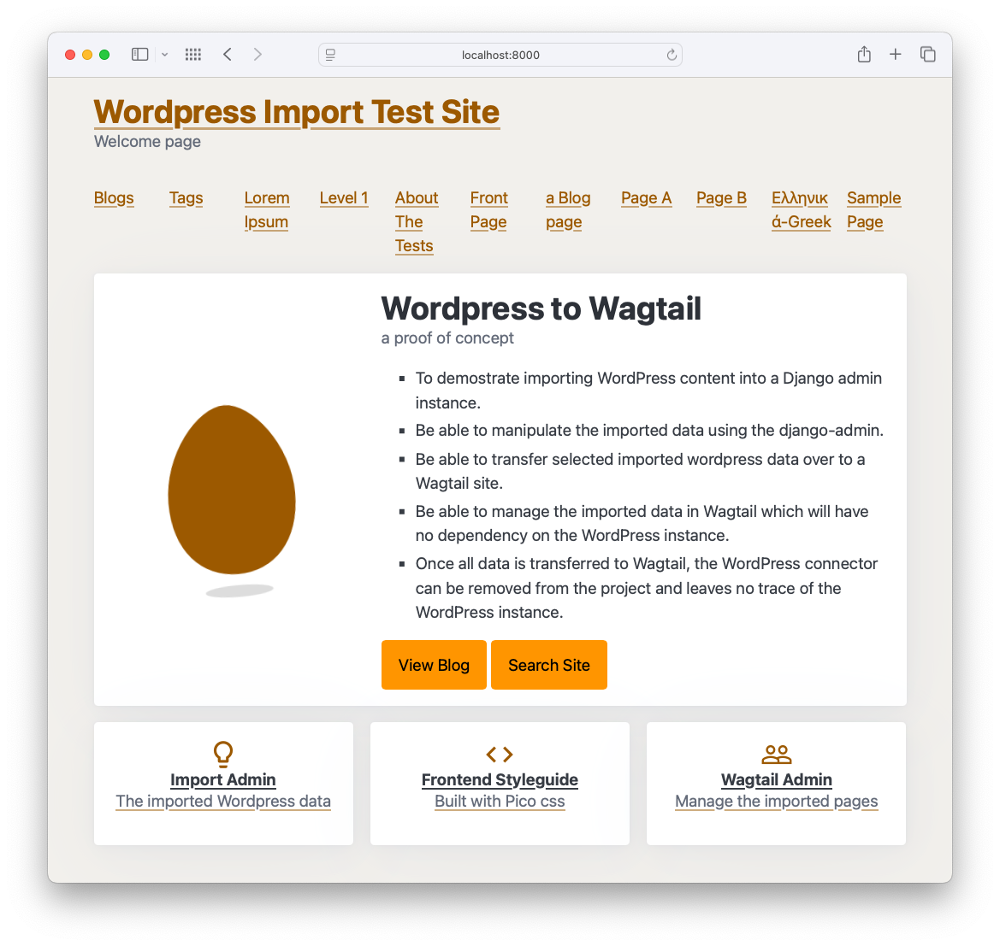
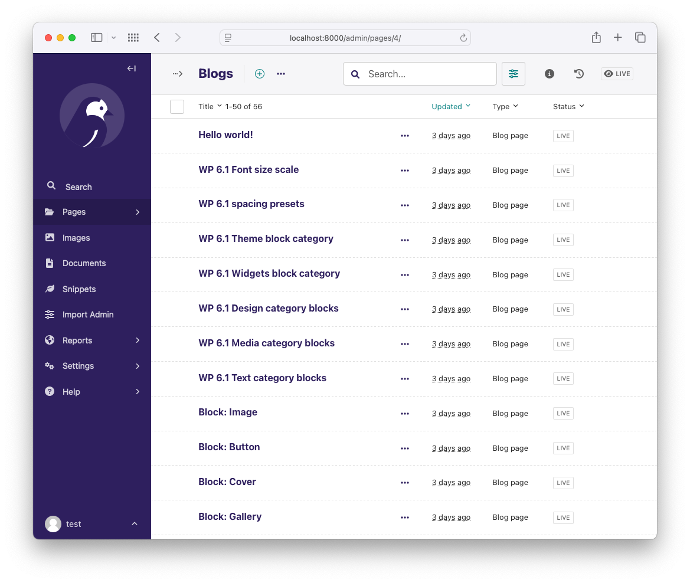
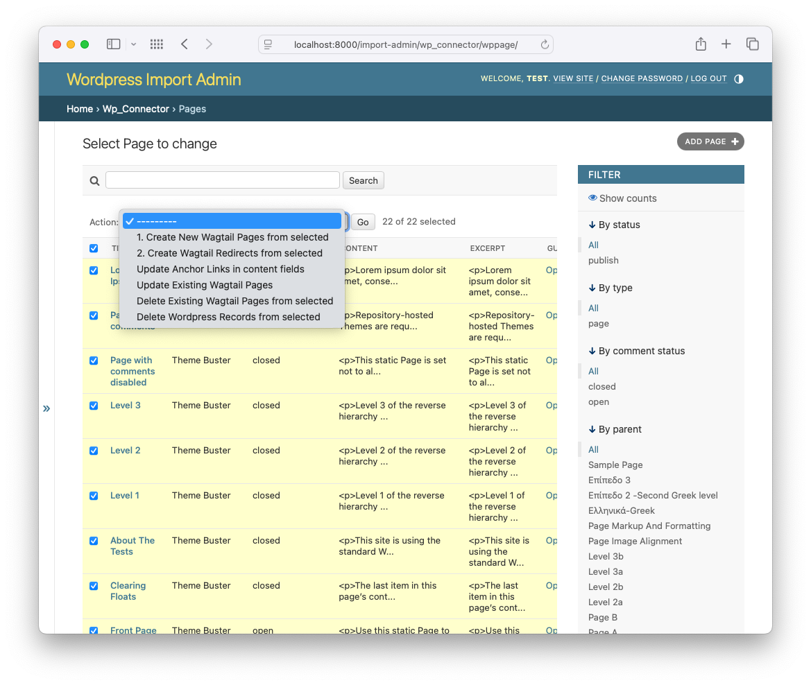

# Wordess to Wagtail Importer (Experimental)

This is an experimental project to import WordPress content including pages and posts into Wagtail.

It's not yet ready for production use but a lot of the basic functionality is in place.

## Requirements

- Python 3.10+ (earlier versions may work)
- Poetry & Docker
- WordPress CLI (instllled via Docker)
- Wordpress Data (currently using a test data set used for building themes)
- Wagtail v6.4 (earlier versions may work)
- Django v5.1 (earlier versions may work)
- Lots of patience :)

## Overall Goals

- To demostrate importing WordPress content into a Django app.
- Be able to manipulate the imported data using the django-admin.
- Be able to transfer selected imported wordpress data over to a Wagtail site.
- Be able to manage the imported data in Wagtail which will have no dependency on the WordPress instance.
- Once all data is transferred to Wagtail, the WordPress connector app can be removed from the project.

The overall workflow is as follows:

1. Import WordPress data into Django
2. Manage the imported data in the Django admin
3. Transfer the data to Wagtail from the Django admin
4. Manage the transferred data in the Wagtail admin
5. Remove the WordPress connector app from the project

### Importing WordPress data

The importer will use a Django management command that will import the data from a WordPress instance.

Although this example imports data from a local WordPress instance, the importer can be used to import data from any WordPress instance that has the JSON api enabled.

The only package that should be added to your final production site, for importing and transferring the Wordpress Pages and Posts to Wagtail, is the `wp_connector` package. You'll need to add some temporary configuration to Wagtail and then run the importer against your own live WordPress instance, which will need it's JSON api enabled.

### Transfering data to Wagtail

Using the django admin admin interface you will be able to select and transfer  the data to Wagtail. Posts and Pages are the main focus for the transfer but linked data such as authors, categories, tags, etc. are also be transferred across. Authors, Categories and Tags are created as snippets. Tags are created within the available Wagtail taggit integration.

The transfer process also includes creating redirects from the old WordPress urls to the new Wagtail urls.

Images and docs linked to and embedded in the transferred pages and posts are also transferred to Wagtail into the Wagtail media library. This action also including updating the links in the content to point to the new Wagtail media urls. (This is not yet implemented)

### Completing the transfer

Once you have transferred all the data to Wagtail, you can remove the WordPress connector module. This will leave you with a Wagtail site that has no dependency on the WordPress instance. You can then manage the site as you would any other Wagtail site.

## Project Setup

View the [Setup](./docs/setup.md) document for instructions on setting up the project.

## ToDo's

- Images and Documents are not yet imported
- Comments are not yet imported
- and probably lots more I've not yet thought of 😆

## Issues

I am maintaing a list of issues and features in the [issues](https://github.com/wagtail-examples/wagtail-wordpress-connector/issues) section of the repository.

## Contributing

If you would like to contribute to this project, please fork the repository and submit a pull request.
