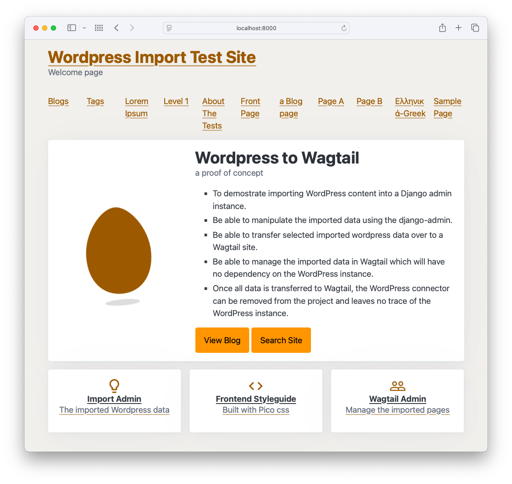
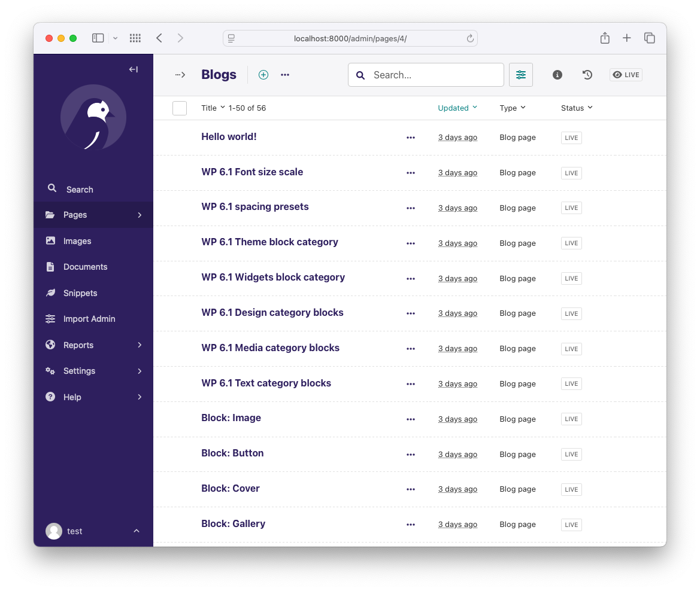
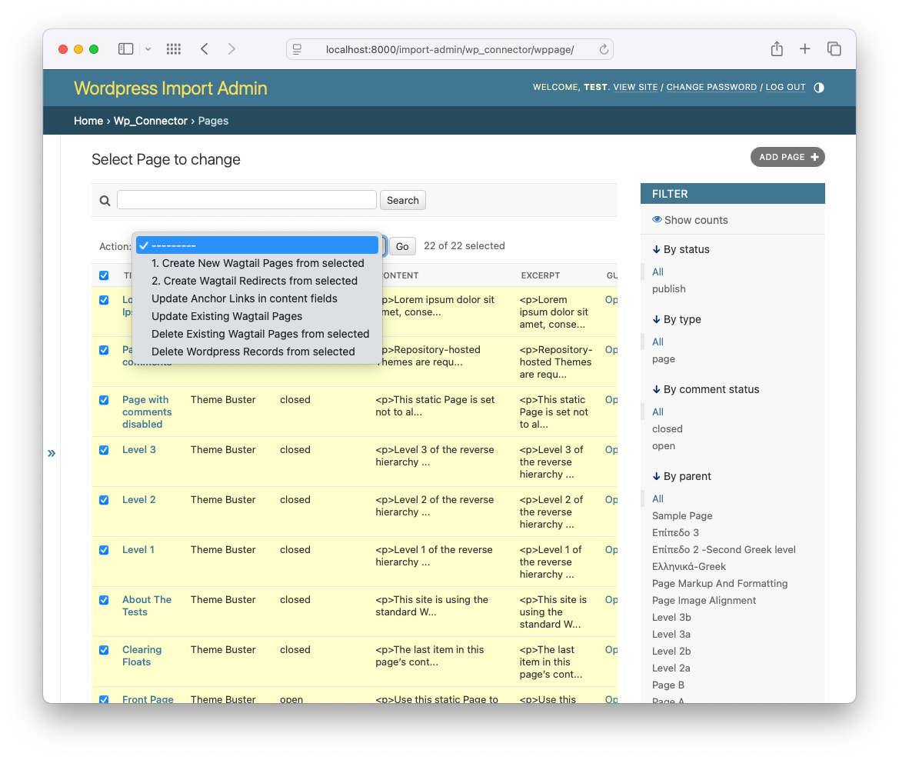

# WordPress to Wagtail Connector Documentation

Welcome to the documentation for the WordPress to Wagtail Connector. This project helps you migrate content from WordPress to Wagtail.

## Documentation Index

- [Setup & Usage Guide](./setup.md) - Main guide for setting up and using the connector
- [Field Mapping Guide](./field_mapping.md) - Detailed information on mapping WordPress fields to Wagtail
- [Troubleshooting Guide](./troubleshooting.md) - Solutions for common issues and command reference
- [Project Structure Guide](./project_structure.md) - Overview of the project organization and components

## Quick Command Reference

The project uses Make commands for its operations:

```bash
# Get help with all available commands
make help

# Start everything (WordPress, import data, Wagtail)
make start

# Stop services
make stop
```

See the [Troubleshooting Guide](./troubleshooting.md) for a complete command reference.

## Screenshots

### Wagtail Site with Imported WordPress Data



### Wagtail Admin for Managing Imported Data



### Django Admin for Transferring Data



## Additional Resources

- [GitHub Repository](https://github.com/wagtail-examples/wagtail-wordpress-connector)
- [Wagtail Documentation](https://docs.wagtail.org/)
- [WordPress REST API Documentation](https://developer.wordpress.org/rest-api/)
- [Changelog](../CHANGELOG.md)

## Project Status

This is an experimental project to import WordPress content including pages and posts into Wagtail. It's not yet ready for production use, but most of the core functionality is in place.

## Contributing

Contributions to the WordPress to Wagtail connector are welcome! See the [README.md](../README.md) file for details on how to contribute.
